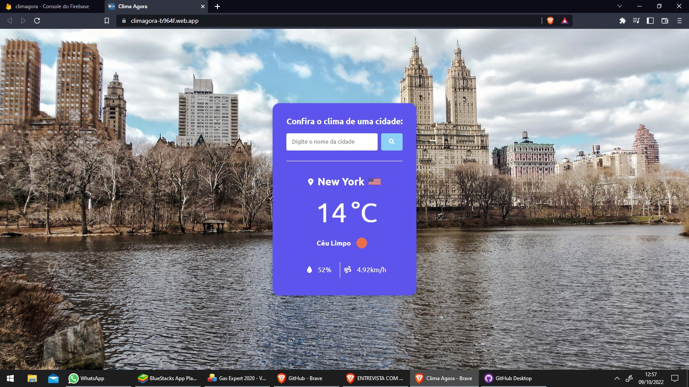

# app_de_clima
 
 

> App Clima Agora 

Projeto construído do tutorial em video HORA DE CODAR, (com modificações).

[🔗 Clique aqui para acessar gitHub](https://github.com/peterson1dhon/app_de_clima)

[🔗 Clique aqui para acessar site no ar](https://climagora-b964f.web.app/)

## 🛠 Tecnologias

- HTML 5
- CSS 3
- JAVASCRIPT
- API open weather
- Git e Github

## 💛 Contato

peterson.br94@gmail.com

